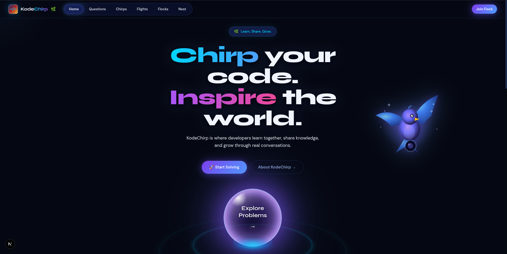
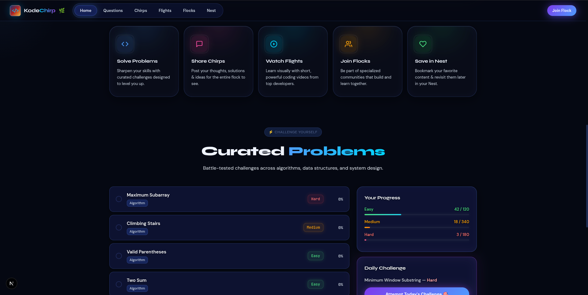
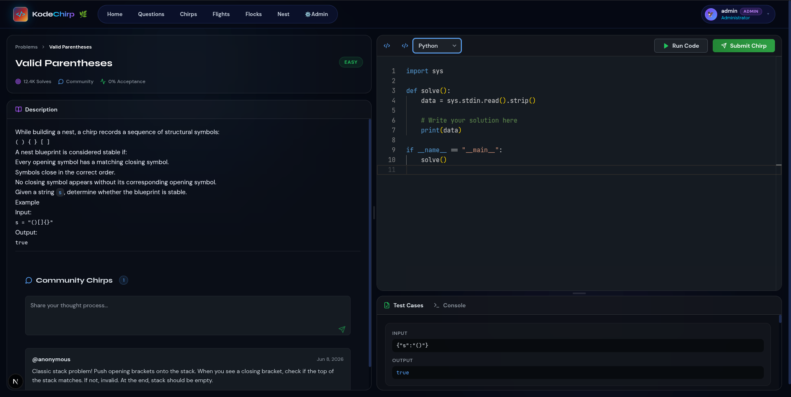
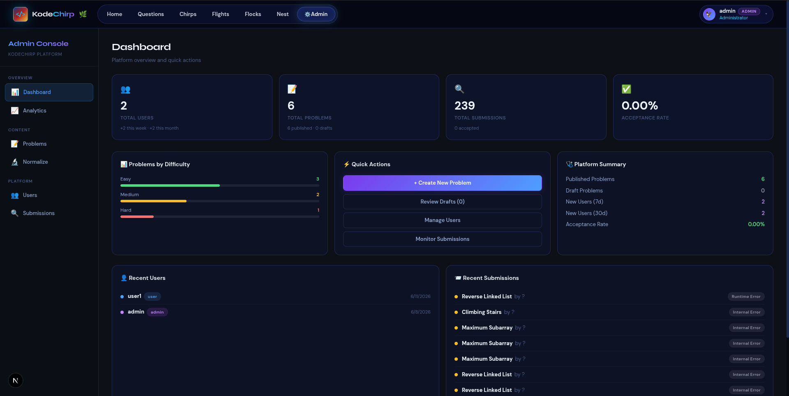
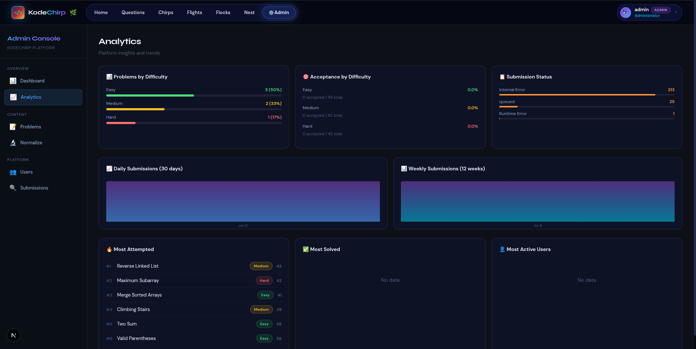
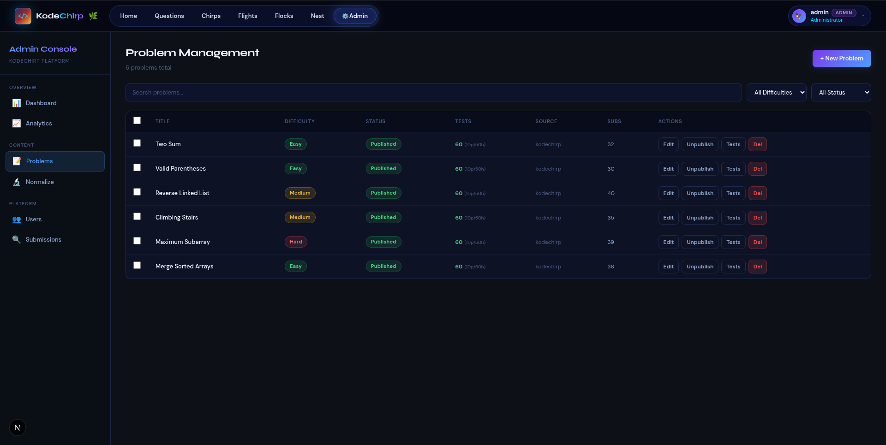
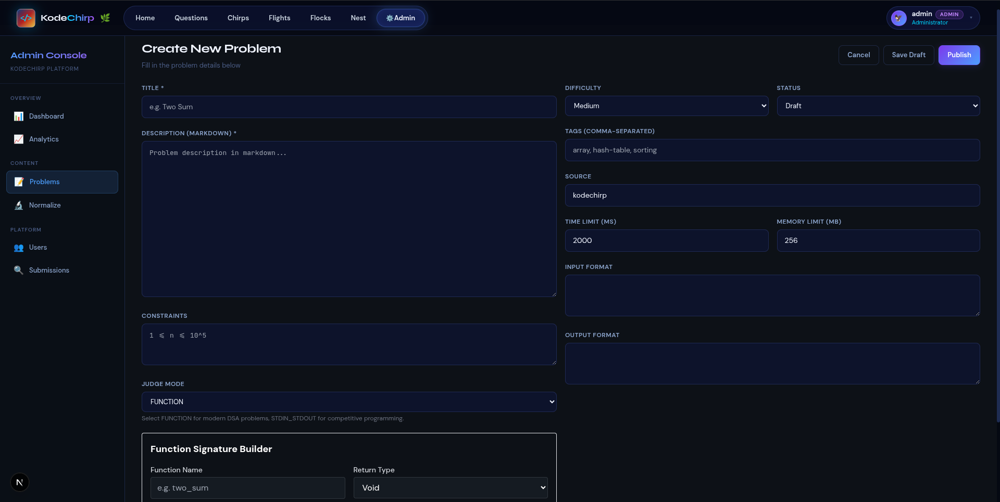
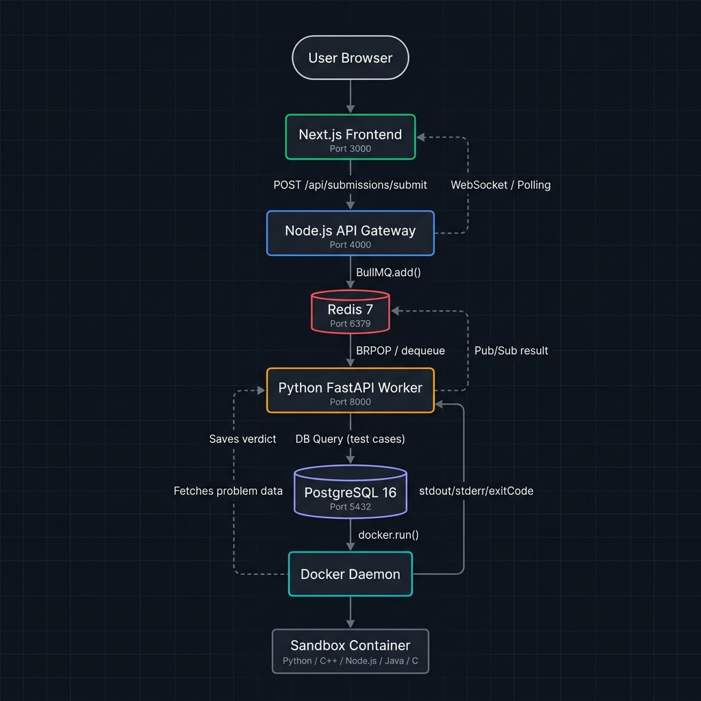
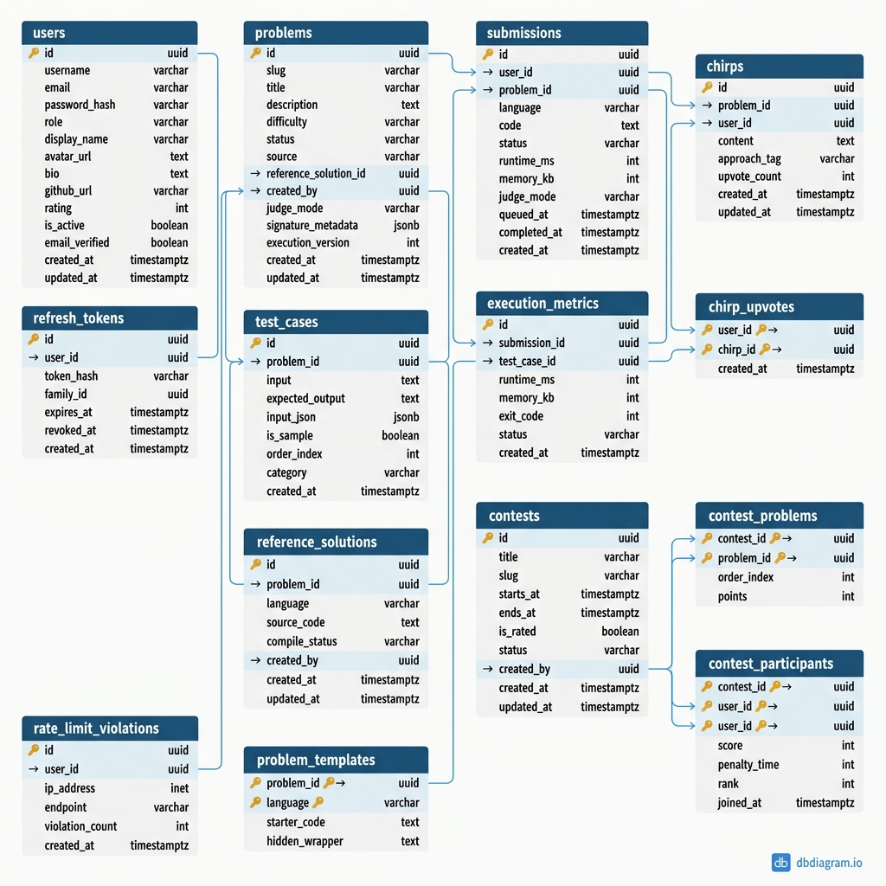

<div align="center">

# 🐦 KodeChirp

### A Production-Grade Distributed Online Judge & Learning Platform

**Solve. Learn. Collaborate.** — The competitive programming platform where developers grow together through secure code execution, community-driven explanations, and live contests.

[](https://nodejs.org)
[](https://fastapi.tiangolo.com)
[](https://nextjs.org)
[](https://redis.io)
[](https://docker.com)
[](https://postgresql.org)
[](https://socket.io)

[📖 Documentation](./docs/) · [🏗 Architecture](./docs/architecture.md) · [🚀 Quick Start](#-quick-start) · [🗺 Roadmap](#-roadmap)

</div>

---

## 📋 Table of Contents

- [What is KodeChirp?](#-what-is-kodechirp)
- [Product Showcase](#-product-showcase)
- [Key Features](#-key-features)
- [Why KodeChirp?](#-why-kodechirp)
- [System Architecture](#-system-architecture)
- [Submission Lifecycle](#-submission-lifecycle)
- [Tech Stack](#-tech-stack)
- [Engineering Challenges Solved](#-engineering-challenges-solved)
- [Database Overview](#-database-overview)
- [Repository Structure](#-repository-structure)
- [Quick Start](#-quick-start)
- [Security Model](#-security-model)
- [Production Readiness & Scaling](#-production-readiness--scaling)
- [Roadmap](#-roadmap)
- [Contributing](#-contributing)
- [Documentation Hub](#-documentation-hub)

---

## 🐦 What is KodeChirp?

KodeChirp is a **full-stack distributed online judge** built from scratch — designed not just for solving coding problems, but for **learning why** solutions work through community collaboration.

### Who is it for?

- **Competitive programmers** looking for a modern judging platform
- **Students** learning DSA through peer explanations
- **Educators** who need a self-hosted, customizable assessment platform
- **Engineering teams** evaluating secure code execution infrastructure

### What makes it different?

Traditional platforms focus solely on **solving**. KodeChirp adds two layers most platforms ignore:

| Layer | Feature | How |
| :--- | :--- | :--- |
| **Solve** | Online Judge | Docker-sandboxed execution with dual judge modes |
| **Learn** | Chirps | Community-authored explanations per problem |
| **Collaborate** | Contests & Flocks | Live rated competitions and learning communities |

KodeChirp also ships with a complete **problem authoring pipeline** — including FUNCTION-mode auto-wrapper generation, AI-assisted test normalization, and a full admin console for content management.

---

## 🖼 Product Showcase

<table>
  <tr>
    <td align="center"><br /><strong>Landing Page</strong><br />Dark-themed hero with glassmorphism</td>
    <td align="center"><br /><strong>Problems & Progress</strong><br />Curated problems with difficulty tracking</td>
  </tr>
  <tr>
    <td align="center"><br /><strong>Code Editor</strong><br />Monaco editor with split-pane view</td>
    <td align="center"><br /><strong>Admin Dashboard</strong><br />Platform metrics and quick actions</td>
  </tr>
  <tr>
    <td align="center"><br /><strong>Analytics Console</strong><br />Submission trends and insights</td>
    <td align="center"><br /><strong>Problem Management</strong><br />Full CRUD with lifecycle states</td>
  </tr>
  <tr>
    <td colspan="2" align="center"><br /><strong>Problem Authoring</strong><br />Function signature builder with dual judge modes</td>
  </tr>
</table>

> **📸 Screenshots stored in:** [`docs/assets/screenshots/`](./docs/assets/screenshots/)

---

## ⚡ Key Features

### 🐳 Execution Engine
- **Docker Sandboxing** — Hardened Alpine containers with strict resource limits
- **Dual Judge Modes** — `STDIN_STDOUT` (classic CP) and `FUNCTION` (auto-wrapper generation)
- **5 Languages** — C, C++, Python 3, Node.js 20, Java 21
- **Async Pipeline** — BullMQ queues decouple submission intake from execution
- **Per-Test-Case Metrics** — Runtime, memory, exit code, stdout/stderr per test

### 📚 Learning Platform
- **Chirps** — Peer-authored explanations with upvoting per problem
- **Community Solving** — Share thought processes, not just solutions
- **Progress Tracking** — Per-difficulty solve counts and daily challenges

### 🏆 Contest Platform
- **Live Contests** — Timed competitions with penalty scoring
- **Leaderboards** — Real-time ranked standings with ELO-based ratings
- **Rated System** — 1200 base rating with post-contest recalculation

### 🛡️ Administration
- **Problem Lifecycle** — `Draft → Review → Published → Archived` workflow
- **AI Normalization** — Auto-generate and validate test cases against reference solutions
- **RBAC** — `user`, `moderator`, `admin` roles with route-level enforcement
- **Analytics Dashboard** — Submission trends, difficulty distributions, acceptance rates

---

## 💡 Why KodeChirp?

Most competitive programming platforms are **black boxes** — submit code, get a verdict. There's no space to ask *"why does this approach work?"* or read how others thought about the problem.

**KodeChirp bridges this gap:**

```
Traditional Platform:         KodeChirp:
┌──────────────┐              ┌──────────────┐
│  Read Problem │              │  Read Problem │
│       ↓       │              │       ↓       │
│  Write Code   │              │  Write Code   │
│       ↓       │              │       ↓       │
│  Get Verdict  │              │  Get Verdict   │
│               │              │       ↓       │
│    (done)     │              │  Read Chirps  │  ← Learn from peers
│               │              │       ↓       │
│               │              │  Write Chirp  │  ← Teach others
│               │              │       ↓       │
│               │              │  Join Contest │  ← Compete & grow
└──────────────┘              └──────────────┘
```

The platform is purpose-built for **educational environments** where understanding matters more than speed — while still supporting full competitive programming workflows.

---

## 🏗 System Architecture

KodeChirp follows a **gateway-worker architecture** — separating API routing, authentication, and real-time delivery (Node.js) from compute-heavy code execution (Python/FastAPI). Redis serves as the async message broker.



| Component | Technology | Role |
| :--- | :--- | :--- |
| **Frontend** | Next.js 16 + React | Monaco editor, problem UI, admin console |
| **API Gateway** | Node.js 20 + Express | Auth, routing, BullMQ dispatch, WebSocket hub |
| **Workers** | Python 3.12 + FastAPI | Queue consumer, Docker orchestration, evaluation |
| **Job Queue** | Redis 7 + BullMQ | FIFO submission queue, Pub/Sub event bus |
| **Sandboxes** | Docker + Alpine | Isolated, ephemeral, hardened containers |
| **Database** | PostgreSQL 16 | 13-table schema, UUID PKs, GIN indexes |

> 📖 **Deep dive:** [Architecture Guide](./docs/architecture.md)

---

## 🔁 Submission Lifecycle

The submission pipeline is fully asynchronous — the strongest piece of engineering in the platform.

```
 User               Frontend            Gateway             Redis              Worker             Docker
  │                    │                   │                   │                  │                  │
  │   Submit Code      │                   │                   │                  │                  │
  ├──────────────────► │                   │                   │                  │                  │
  │                    │  POST /submit     │                   │                  │                  │
  │                    ├──────────────────►│                   │                  │                  │
  │                    │                   │  Validate + Store │                  │                  │
  │                    │                   │  (PostgreSQL)     │                  │                  │
  │                    │                   │  BullMQ.add()     │                  │                  │
  │                    │                   ├──────────────────►│                  │                  │
  │                    │  { submissionId,  │                   │                  │                  │
  │                    │  status: queued } │                   │                  │                  │
  │                    │◄──────────────────┤                   │                  │                  │
  │                    │                   │                   │  BRPOP/dequeue   │                  │
  │                    │                   │                   │◄─────────────────┤                  │
  │                    │                   │                   │                  │  docker.run()    │
  │                    │                   │                   │                  ├─────────────────►│
  │                    │                   │                   │                  │ stdout/stderr    │
  │                    │                   │                   │                  │◄─────────────────┤
  │                    │                   │                   │  PUB completed   │                  │
  │                    │  GET /poll        │                   │◄─────────────────┤                  │
  │                    ├──────────────────►│◄──────────────────┤                  │                  │
  │  Result Display    │◄──────────────────┤                   │                  │                  │
  │◄───────────────────┤  { accepted }     │                   │                  │                  │
```

**Status Lifecycle:** `queued` → `processing` → `running` → `accepted` | `wrong_answer` | `TLE` | `runtime_error` | `compilation_error`

> 📖 **Deep dive:** [Execution Pipeline](./docs/execution-pipeline.md)

---

## 🧰 Tech Stack

| Layer | Technologies |
| :--- | :--- |
| **Frontend** | Next.js 16, React 18, Monaco Editor, Tailwind CSS, Zustand |
| **API Gateway** | Node.js 20, Express 4, Socket.IO 4, BullMQ 5, Pino |
| **Workers** | Python 3.12, FastAPI 0.115, Docker SDK, asyncio |
| **Infrastructure** | Redis 7, PostgreSQL 16, Nginx, Docker Compose v2 |
| **Sandboxes** | 5× Alpine Linux (GCC 13, G++ 13, Python 3.12, Node 20, JDK 21) |
| **Security** | JWT + bcryptjs, Helmet.js, express-validator, CORS |
| **Testing** | Jest, Supertest |

---

## 🏆 Engineering Challenges Solved

> *The hardest technical problems solved in building KodeChirp.*

### 🔒 Secure Code Execution
- **Non-root containers** — All code runs as unprivileged `runner` user
- **Network isolation** — `--network=none` blocks all traffic
- **Read-only filesystem** + **capability dropping** (`--cap-drop=ALL`)
- **PID limits** — Prevents fork bombs
- **Docker Socket Proxy** — Scoped proxy (only `CONTAINERS`, `IMAGES`, `POST`)

### 📡 Distributed Processing
- **BullMQ** over Redis — reliable FIFO with configurable retries
- **Redis Pub/Sub** — bridges Python workers and Node.js gateway
- **Stateless workers** — scale with `docker compose up --scale worker=N`

### ⚙️ Multi-Language Wrapper Generation
- `signature_metadata` JSONB → auto-generated wrappers per language
- Each wrapper handles JSON I/O, type conversion, and function invocation
- Templates stored per-problem-per-language for editor integration

### 📊 Real-Time Updates
- **Socket.IO** hub on gateway relays submission status changes
- **Redis Pub/Sub** bridges worker → gateway → client
- Sub-second result delivery with polling fallback

---

## 🗄 Database Overview

13-table PostgreSQL schema with UUID PKs, GIN indexes on JSONB, and `updated_at` auto-triggers.



```
users ──────────────────┬── refresh_tokens
  │                     ├── problems (created_by)
  │                     ├── submissions
  │                     ├── chirps / chirp_upvotes
  │                     ├── contests (created_by)
  │                     └── contest_participants

problems ───────────────┬── reference_solutions
  │                     ├── problem_templates
  │                     ├── test_cases
  │                     ├── submissions
  │                     └── contest_problems

submissions ────────────└── execution_metrics
```

> 📖 **Deep dive:** [Database Design](./docs/database.md)

---

## 📁 Repository Structure

```
kodechirp/
├── frontend/                    # Next.js 16 React Frontend
│   ├── app/                     # App Router pages & layouts
│   ├── components/              # UI + Monaco editor
│   ├── hooks/                   # useAuth, useEditor, useSubmission
│   └── store/                   # Zustand slices
├── gateway/                     # Node.js API Gateway
│   ├── src/
│   │   ├── controllers/         # Route handlers
│   │   ├── middleware/          # JWT, rate limiter
│   │   ├── queue/               # BullMQ producer + Pub/Sub
│   │   └── websocket/           # Socket.IO events
│   └── tests/                   # Jest + Supertest
├── workers/                     # Python FastAPI Workers
│   └── src/
│       ├── services/            # Redis, PostgreSQL, Docker SDK
│       └── worker/              # Queue consumer + evaluator
├── sandboxes/                   # 5× Hardened Docker images
│   └── c/ cpp/ python/ node/ java/
├── database/
│   ├── schema.sql               # 13-table production schema
│   └── seeds/                   # Development seed data
├── docs/                        # Technical documentation
├── docker-compose.yml           # Full 6-service stack
└── .env.example                 # Environment template
```

---

## 🚀 Quick Start

### Prerequisites

| Tool | Version |
| :--- | :--- |
| Docker Engine | 24+ |
| Docker Compose | v2+ |
| Node.js | 20+ |
| Python | 3.11+ |

### One-Command Launch

```bash
# 1. Clone
git clone https://github.com/ritam4735/kodechirp.git && cd kodechirp

# 2. Configure
cp .env.example .env
# Edit .env — set JWT_SECRET, JWT_REFRESH_SECRET, POSTGRES_PASSWORD

# 3. Build sandbox images (one-time)
npm run build:sandboxes

# 4. Launch everything
npm run dev
```

| Service | URL |
| :--- | :--- |
| Frontend | http://localhost:3000 |
| API Gateway | http://localhost:4000 |
| PostgreSQL | localhost:5433 |
| Redis | localhost:6380 |

> 📖 **Advanced setup:** [Deployment Guide](./docs/deployment.md)

---

## 🛡 Security Model

Every code submission is treated as **untrusted input** with defense-in-depth.

| Control | Implementation |
| :--- | :--- |
| **Non-root execution** | Unprivileged `runner` user |
| **Network disabled** | `--network=none` — zero connectivity |
| **Read-only FS** | Container filesystem mounted read-only |
| **Capability dropping** | `--cap-drop=ALL` |
| **Resource limits** | Memory (256 MB), CPU shares, PID limits |
| **Execution timeout** | Hard timeout (default 10s) |
| **JWT auth** | Short-lived access + rotating refresh families |
| **Rate limiting** | Nginx zones (20 req/s API, 3 req/s auth) |
| **Security headers** | Helmet.js (CSP, HSTS, X-Frame-Options) |

> 📖 **Deep dive:** [Security Design](./docs/security.md)

---

## 📈 Production Readiness & Scaling

### Current Capabilities
- **Horizontal worker scaling** — `docker compose up --scale worker=N`
- **Stateless gateway** — No in-memory state; any instance serves any request
- **Redis event bus** — Decouples services; enables independent deployment
- **Async processing** — BullMQ with configurable concurrency, retries, backoff
- **Health checks** — All services expose health endpoints

### Future
- 🔜 Kubernetes manifests + Helm charts
- 🔜 Multi-host workers with container orchestration
- 🔜 Auto-scaling based on queue depth metrics
- 🔜 Prometheus + Grafana monitoring
- 🔜 Service mesh with mutual TLS

---

## 🗺 Roadmap

### Near Term
- [ ] Contest mode with live standings and timed submissions
- [ ] Distributed worker deployment across multiple hosts
- [ ] Execution analytics dashboard

### Future
- [ ] Kubernetes manifests + Helm charts
- [ ] Prometheus + Grafana monitoring
- [ ] AI-assisted debugging ("Explain My Mistake" via LLM)
- [ ] Plagiarism detection (MOSS / token-based similarity)
- [ ] GitHub OAuth + social login
- [ ] Discussion threads on Chirps

### Long-Term Vision
- [ ] Auto-scaling based on queue depth
- [ ] Multi-tenant deployment for universities
- [ ] CDN-backed static asset delivery
- [ ] Community-rated problem difficulty

---

## 🤝 Contributing

1. **Fork** the repository
2. **Branch**: `git checkout -b feature/your-feature`
3. **Test**: `cd gateway && npm test`
4. **Commit**: `git commit -m 'feat: your feature'`
5. **Push** and open a Pull Request

---

## 📖 Documentation Hub

| Document | Description |
| :--- | :--- |
| [Architecture Guide](./docs/architecture.md) | System design, component responsibilities, topology |
| [Execution Pipeline](./docs/execution-pipeline.md) | Queue lifecycle, worker processing, wrapper generation |
| [Database Design](./docs/database.md) | Full schema, relationships, index strategy |
| [Security Design](./docs/security.md) | Sandbox controls, threat model, JWT mechanics |
| [Deployment Guide](./docs/deployment.md) | Docker Compose, env vars, scaling, production |
| [API Reference](./docs/api-reference.md) | Complete endpoint documentation |

---

<div align="center">

**Built with ♥ by [Ritam](https://github.com/ritam4735)**

*KodeChirp — Where developers learn together.*

</div>
